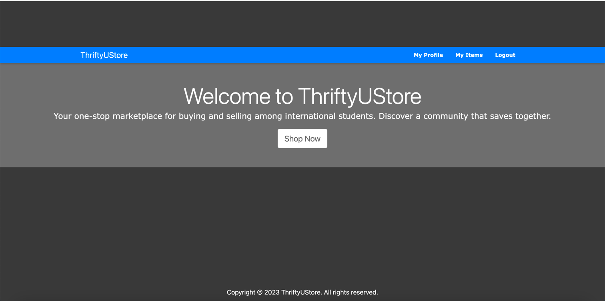

# README
Welcome to **ThriftyUStore** website!

Your one-stop marketplace for buying and selling among international students. Discover a community that saves together.

## Team Members:
1. Haowen Xu - hx2364
2. Zhicheng Zou - zz3105
3. Wenjia Zhang - wz2647
4. Meixuan Lu - ml4965

## Updates for the Demo Sprint:
1. Update the CSS style for the whole website, to make the website visually appealing.
2. We added the "wish list" feature, where users can add/remove item to/from wish list, and view all items in the wish list.
3. We added a function to mark an item to be sold by inputting a buyer's email. Once an item is marked as sold, the status will show up on the item page.
4. The buyer of the item can rate the item numerically from 1 to 5. The item rating will also be shown in the item detail page.
5. Each user will have a specific rating, where this rating comes from other users who bought the items the current user has posted. And the buyer's rating will shown on the each item page that the user posts.
6. Add a sort item function based on user's rating.

## How To Run:
***You need to add your own ".env" file with the credentials in order to use Google Authentication.
The format should follow ".env_example" file.***

1. cd into ThriftUStore repo
2. run ``bundle install`` to install gems
3. run ``bin/rails db:migrate`` to update database.
4. run ``bundle exec rails s`` to start the server.
5. run ``bundle exec rake spec`` to run the rspec tests
6. run ``bundle exec rake assets:precompile`` and ``bundle exec cucumber --guess`` to run the cucumber tests.

## Deployment:

### Link to Deployment: 
https://ghoulish-phantom-17472-ad85f4912cba.herokuapp.com/

#### The database run in Heroku is PostgreSql, the database run in local is sqlite3. Before push to Heroku, run ``heroku run rake db:migrate`` to update the database in the Heroku and run ``git push heroku main``.

## Updates on Sprint2:
1. Item Comments - We enabled the functionality to allow users to ***add/delete/update*** comments to the items posted to the website.
2. Search Items - We implemented the search function to match any potential query on the price and item title.
3. Filter Items - We implemented the filter function to sort the posted items on price and item name.
4. Refine the CSS style, including using bootstrap to make the webpage visually appealing.
5. Add navigation header to each page to allow easy access.
6. Included some simple test data to the database for demonstration.
7. Enabled Google Oauth2 login.
