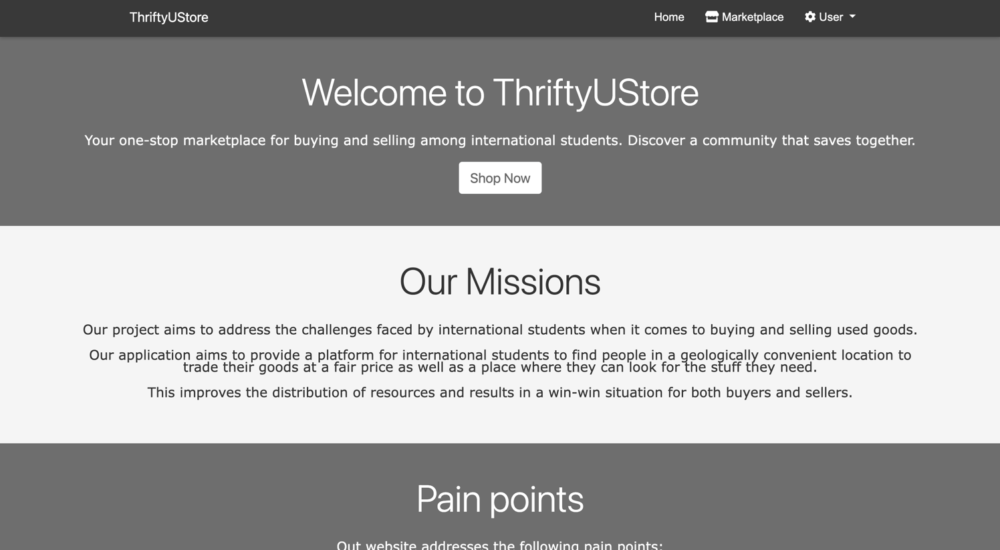

# README
Welcome to **ThriftyUStore** website!

Your one-stop marketplace for buying and selling among international students. Discover a community that saves together.

## Team Members:
1. Haowen Xu - hx2364
2. Zhicheng Zou - zz3105
3. Wenjia Zhang - wz2647
4. Meixuan Lu - ml4965

## Features:
1. Log in via email and password.
2. Google SSO login.
3. Profile page that shows the user's personal information including name, email, address, etc.
4. The authorized user can modify their own profile or cancel the account.
5. Market place page that shows all current items with name, price and image
6. Search Items - users can search by the price and item title.
7. Sort Items - users can sort the items by price or title or seller's rating in ascending or descending order.
8. My Item page that shows all items posted by the current user and they can go to the detail page of the items.
9. Current user can post new items, edit existing items, delete existing items of their own.
10. Item Detail page that shows the detail of the items including title, description, price, seller's rating, and how many people has added it to the wishlist.
11. The User can go to the seller and the commenters' profile pages in the item detail page.
12. Item Comments - users can ***add/delete/update*** comments to the items posted to the website.
13. Wishlist - users can add or remove an item to their wishlist, as well as conveniently view all items in their wish list.
14. Sellers can mark an item as sold by entering the buyer's email. Once marked as sold, the status will be prominently displayed on the respective item page.
15. Buyers can numerically rate items on a scale of 1 to 5 or edit their previous ratings. The assigned item rating will be prominently showcased on the item detail page. The average rating of a users' all items will be also be presented in the item detail page and profile page.

## How To Run:
***You need to add your own ".env" file with the credentials in order to use Google Authentication.
The format should follow ".env_example" file.***

1. cd into ThriftUStore repo
2. run ``bundle install`` to install gems
3. run ``bin/rails db:migrate`` to update database.
4. run ``bundle exec rails s`` to start the server.
5. run ``bundle exec rake spec`` to run the rspec tests
6. run ``bundle exec rake assets:precompile`` and ``bundle exec cucumber --guess`` to run the cucumber tests.

## Deployment:

### Link to Deployment: 
https://ghoulish-phantom-17472-ad85f4912cba.herokuapp.com/

#### The database run in Heroku is PostgreSql, the database run in local is sqlite3. Before push to Heroku, run ``heroku run rake db:migrate`` to update the database in the Heroku and run ``git push heroku main``. To clear the database, run ``heroku pg:reset postgresql-encircled-88880``.
``

### Link to Github:
https://github.com/TechTitans-SAAS/ThriftUStore-4152SAAS
